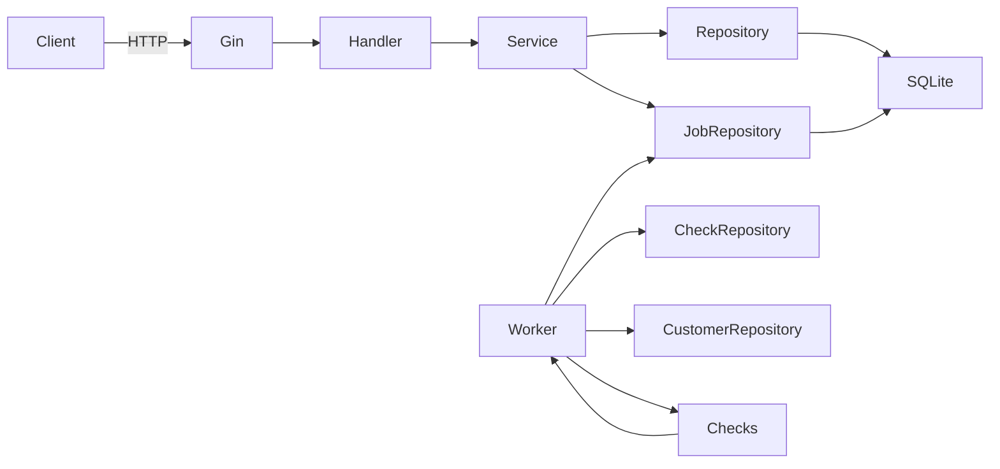
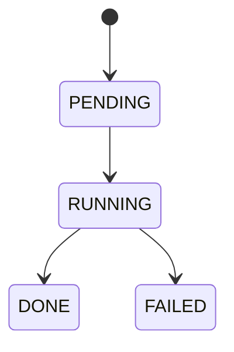

# KYC Simulation Service (Go)

Este projeto implementa uma **simulação realista de um sistema de KYC (Know Your Customer)** usando **Golang**, com arquitetura em camadas, **injeção de dependências**, **processamento assíncrono com jobs**, **worker**, e **persistência via SQLite + GORM**.

O objetivo **não é ser um CRUD**, mas sim demonstrar **disciplina arquitetural**, separação de responsabilidades e um fluxo semelhante ao que existe em sistemas KYC reais.

---

## Visão Geral da Arquitetura

- API HTTP com **Gin**
- Camada de **Service** com regras de negócio
- Camada de **Repository** isolando o banco
- **Fila durável** baseada em banco (SQLite)
- **Worker assíncrono** executando checks
- **Decisão automática de KYC**
- Observabilidade via endpoint de Job

---

## Fluxo Funcional do KYC

1. Criar Customer (DRAFT)
2. Editar Customer (apenas DRAFT)
3. Anexar Documentos
4. Submit do KYC
5. Enfileirar checks
6. Worker executa checks
7. Sistema decide APPROVED / REJECTED / IN_REVIEW
8. Cliente consulta status e progresso

---

## Estrutura de Pastas

```
cmd/
 └─ api/
    └─ main.go            # bootstrap da aplicação

internal/
 ├─ config/               # config por ambiente
 ├─ db/                   # conexão e migrations
 ├─ domain/
 │  ├─ enums.go           # enums de domínio
 │  ├─ errors.go          # erros de domínio
 │  └─ models/            # entidades persistidas
 ├─ dto/
 │  ├─ requests/          # payloads de entrada
 │  └─ responses/         # payloads de saída
 ├─ repository/
 │  ├─ interfaces/        # contratos (ports)
 │  └─ gorm/              # implementação GORM
 ├─ service/
 │  ├─ interfaces/        # contratos de negócio
 │  └─ impl/              # regras de negócio
 ├─ http/
 │  ├─ handler/           # controllers HTTP
 │  ├─ router/            # rotas Gin
 │  └─ middleware/        # mapeamento de erros
 ├─ worker/
 │  ├─ runner.go          # loop do worker
 │  ├─ processor.go      # execução de jobs
 │  └─ checks/            # checks plugáveis
 └─ di/
    └─ container.go       # composição de dependências
```

---

## Princípios Arquiteturais

### 1. Handlers não conhecem banco
Handlers **somente** chamam Services.

### 2. Services concentram regras
Toda regra de estado, validação e transição vive no Service.

### 3. Repositories isolam persistência
Nenhuma camada acima conhece GORM.

### 4. Worker não depende de HTTP
Worker usa Services / Repositories diretamente.

### 5. Tudo é injetado
Nenhum `new()` espalhado. Toda composição ocorre no container.

---

## Modelo de Dados (Resumo)

- Customer
- Document
- Check
- Job
- JobItem

---

## Diagrama de Arquitetura (Mermaid)



---

## Diagrama do Fluxo de Job



---

## Endpoints Principais

### Customer
- POST `/v1/kyc/customers`
- PATCH `/v1/kyc/customers/:id`
- GET `/v1/kyc/customers/:id`
- POST `/v1/kyc/customers/:id/submit`

### Documents
- POST `/v1/kyc/customers/:id/documents`
- GET `/v1/kyc/customers/:id/documents`

### Checks
- GET `/v1/kyc/customers/:id/checks`
- POST `/v1/kyc/customers/:id/checks/run`

### Jobs
- GET `/v1/kyc/jobs/:jobId`

---

## Worker e Checks

Checks são **plugáveis** via interface:

```go
type Runner interface {
    Run() (CheckStatus, *int, string)
}
```

Implementações:
- CPF/CNPJ
- SANCTIONS
- PEP
- FACE_MATCH

A factory centraliza a escolha do check.

---

## Decisão Automática

Regras aplicadas pelo Worker:

- SANCTIONS = FAIL → REJECTED
- Qualquer FAIL → IN_REVIEW
- Todos PASS → APPROVED

---

## Como Executar

```bash
mkdir data
go run ./cmd/api
```

O banco SQLite será criado automaticamente.

---

## Próximos Passos Possíveis

- Retry e backoff de job
- Dead-letter queue
- Observabilidade com métricas
- Trocar SQLite por Postgres
- Separar Worker em outro processo
- Autenticação / autorização

---

## Conclusão

Este projeto demonstra:
- Arquitetura limpa
- Fluxo assíncrono realista
- Decisões baseadas em estado
- Código preparado para evolução

Ele foi estruturado **para ser entendido, estendido e mantido**, não apenas para funcionar.
